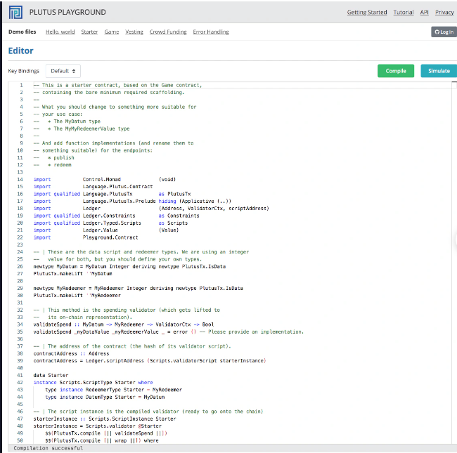
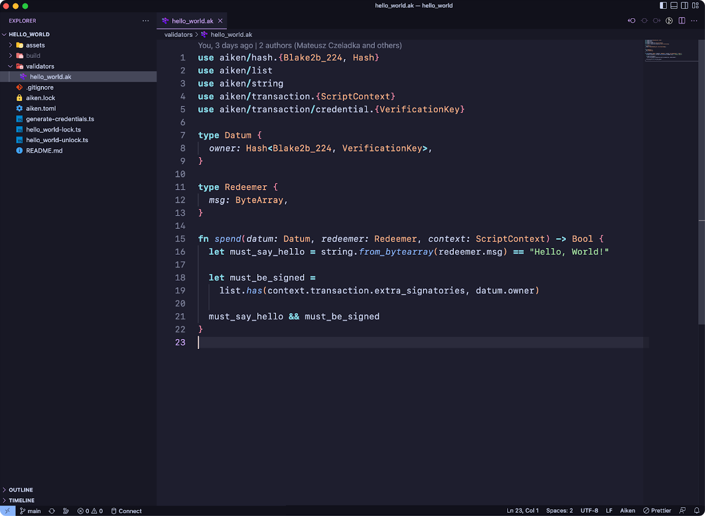

# Introduction to Aiken Language

Trong Cardano đã có một hệ sinh thái phát triển mạnh mẽ gồm nhiều ngôn ngữ để viết smart contract. Miễn là các ngôn ngữ này có bộ compilier để biên dịch ra Untyped Plustus Core vì đây là dạng biểu diễn ở tầng thấp nhất cho smart contract (lowest level representation of smart contract) và sẽ được thực thi bởi Cardano Virtual Machine

`Aiken` ⇒ viết các validator script on-chain

Còn off-chain để tương tác với smart contract → JavaScript (`Mesh`), Python(`PyCardano`),…

Về bản chất, Aiken là ngôn ngữ thuần hàm (`purely functional`) với hệ thống kiểu tĩnh (`static typing`) và suy luận kiểu (`type inference`). Điều này giúp người dùng không cần phải chú thích kiểu nhiều vì trình biên dịch đủ thông minh để tự xác định. Aiken cũng hỗ trợ tạo kiểu tùy chỉnh (`custom type`) như records và enums

So với Plutus, Aiken dễ học hơn và rất phù hợp cho những ai chưa quen với các ngôn ngữ lập trình hàm như Haskell.

## Plutus

## Aiken

# Reference

[https://docs.cardano.org/developer-resources/smart-contracts/aiken/](https://docs.cardano.org/developer-resources/smart-contracts/aiken/)

[https://aiken-lang.org/ecosystem-overview](https://aiken-lang.org/ecosystem-overview)