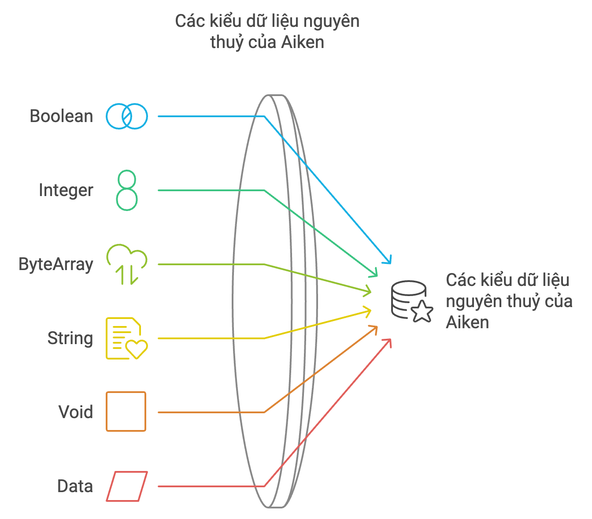

# Primitive Types

Aiken có 6 kiểu dữ liệu nguyên thuỷ (primitive types)



# Boolean (Bool)

Boolean có 2 giá trị: `True` hoặc `False` 

Tương tự các ngôn ngữ khác Aiken cũng có các toán tử cơ bản với giá trị boolean

| Toán tử | Mô tả | Độ ưu tiên |
| --- | --- | --- |
| == | So sánh bằng | 4 |
| && | Toán tử `AND` | 3 |
| \|\| | Toán tử `OR` | 2 |
| ! | Toán tử phủ định | 1 |

Tương tự như các ngôn ngữ khác, `&&` và `||` trong Aiken được xét từ phải qua trái.

- Đối với `&&`, nó sẽ dừng lại khi gặp giá trị `false` đầu tiên và trả về giá trị đó
- Còn với `||`, nó sẽ dừng khi tìm thấy giá trị `true` đầu tiên và trả về kết quả đó

## and/or keyword

Đôi khi, trong một số trường hợp cần xử lý logic phức tạp cho validator với nhiều biểu thức boolean thì code có thể khó đọc, khó debug hơn

```rust
test temp() {
    let is_member = True
    let is_first_time_buyer = True
    let has_spent_over_100 = False
    let has_active_promotion = True

    is_member && is_first_time_buyer && has_spent_over_100 || has_active_promotion == True
}
```

⇒ Solution: sử dụng keyword and, or khiến cho việc đọc logic dễ hơn

```rust
test temp() {
    let is_member = True
    let is_first_time_buyer = True
    let has_spent_over_100 = False
    let has_active_promotion = True

    let result = and {
        is_member,
        is_first_time_buyer,
        or {
            has_spent_over_100,
            has_active_promotion,
        },
    }

    result == True
}
```

# Integer (Int)

Aiken hỗ trợ số nguyên với kích thước tùy ý, đảm bảo không xảy ra hiện tượng tràn số (overflow) hay underflow.

Ngoài ra, Aiken còn hỗ trợ các định dạng số nguyên binary, octal và hex với cú pháp bắt đầu lần lượt bằng `0b`, `0c` và `0x`. Tuy nhiên, những định dạng này thường ít được sử dụng trong thực tế.

```rust
0b00001111 == 15
0o17 == 15
0xF == 15
```

Tương tự như các ngôn ngữ khác, Aiken cũng hỗ trợ các toán tử với số nguyên

| Toán tử | Mô tả | Độ ưu tiên |
| --- | --- | --- |
| + | Cộng | 6 |
| - | Trừ | 6 |
| * | Nhân | 7 |
| / | Chia | 7 |
| % | Modulo (chia lấy dư) | 7 |

Toán tử so sánh với số nguyên

| Toán tử | Mô tả | Độ ưu tiên |
| --- | --- | --- |
| == | So sánh bằng | 4 |
| > | Lớn hơn | 4 |
| < | Bé hơn | 4 |
| ≥ | Lớn hơn hoặc bằng | 4 |
| ≤ | Nhỏ hơn hoặc bằng | 4 |

# ByteArray
Có 3 ký hiểu để khai báo:

- Array of bytes

Giá trị của byte nằm trong khoảng từ 0 đến 255.

```rust
#[10, 255]
```

- Byte string

Chuỗi byte được mã hóa theo chuẩn UTF-8. Đây là cách mà chuỗi được biểu diễn ở tầng bên dưới

```rust
"foo"
```

- Hex-encoded byte string

Trong bối cảnh blockchain, việc xử lý các chuỗi byte được mã hóa ở định dạng base16 (như `transaction id`, `policy id`,…) khá phổ biến. Để hỗ trợ điều này, Aiken cung cấp cú pháp viết tắt cho việc khai báo mảng byte dưới dạng hexadecimal string. Aiken sẽ tự động giải mã chuỗi mã hóa và lưu trữ các raw byte dưới dạng ByteArray.

```rust
#"666f6f"
```

Mọi người có thể tham khảo bảng ánh xạ các ký tự sang số nguyên theo hệ số tại đây: [https://www.charset.org/utf-8](https://www.charset.org/utf-8).

# String

Để khai báo string ta cần thêm `@` trước chuỗi. Và có thể hỗ trợ `UTF-8` 

```rust
let hello_world_str = @"Hello World"
```

Mọi người có thể đọc hơn về stdlib của aiken để có thể sử dụng các hàm được xây dựng để xử lý String

[https://aiken-lang.github.io/stdlib/aiken/primitive/string.html](https://aiken-lang.github.io/stdlib/aiken/primitive/string.html)

**Lưu ý**: việc sử dụng chuỗi trong Aiken và code on-chain cực kỳ hạn chế, chủ yếu dùng chuỗi để tracing. Do đó, hầu hết sẽ dùng `ByteArray`, còn `String` chỉ dùng cho mục đích gỡ lỗi (debug).

# Void

Void là một kiểu đại diện cho một constructor không có tham số, (hay đơn giản hơn không có giá trị). Void vừa là một type, vừa là một constructor.

```rust
type Void {
    Void
}
```

Note: Cách định nghĩa `custom type` mình sẽ giới thiệu ở bài kế tiếp.

Kiểu dữ liệu này thường được sử dụng để chỉ ra rằng một hàm không trả về giá trị nào, tức là kiểu trả về của hàm là `Void`.

Mọi người sẽ hiếm khi sử dụng kiểu dữ liệu này.

# Reference

[https://aiken-lang.org/language-tour/primitive-types#as-an-array-of-bytes](https://aiken-lang.org/language-tour/primitive-types#as-an-array-of-bytes)