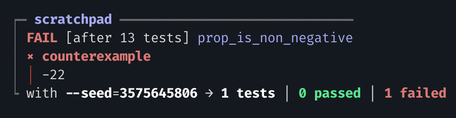

# Unit tests

## Writing unit tests

Sử dụng keyword `test` để tạo unit test

```rust
test foo() {
  1 + 1 == 2
}
```

Unit test là một function được đặt tên, không nhận tham số và trả về giá trị boolean. Kết quả của unit test có hai trạng thái: **pass** (trả về true) hoặc **fail** (trả về false).

Điểm thú vị là các unit test được thực thi trên cùng một virtual machine với VM dùng để chạy contract on-chain

## Unit test reports

```rust
fn add_one(n: Int) -> Int {
  n + 1
}
 
test add_one_1() {
  add_one(0) == 1
}
 
test add_one_2() {
  add_one(-42) == -41
}
```


Nhóm các unit test theo từng module và cung cấp thông tin chi tiết về RAM, CPU sử dụng trong quá trình thực thi. 

⇒ Đánh giá hiệu suất chương trình, từ đó tìm ra các giải pháp tối ưu nhất.⬤

## Automatic diffing

Aiken’s test runner được tối ưu để hỗ trợ debug hiệu quả, đặc biệt khi test case gặp lỗi. Khi một test case thất bại, test runner sẽ cung cấp thông tin chi tiết về nguyên nhân thông qua các phép so sánh như ==, >=, !=,….

```rust
// ... rest of the file is unchanged
test add_one_3() {
  add_one(1) == 1
}
```


# Property-based test

## Short introduction

Đây là một cách kiểm thử bằng cách tạo ra nhiều `dữ liệu input ngẫu nhiên` và kiểm tra xem chương trình có hoạt động đúng với tất cả các đầu vào đó không, thay vì chỉ kiểm tra một vài trường hợp cụ thể.

Mục đích chính:

1. Phát hiện lỗi ẩn: Tạo nhiều dữ liệu đầu vào ngẫu nhiên giúp tìm ra lỗi mà dev có thể bỏ sót khi viết test thủ công.
2. Kiểm tra tính tổng quát: Đảm bảo code hoạt động đúng với mọi đầu vào, kiểm tra nhiều nhánh hơn so với test truyền thống.
3. Tiết kiệm thời gian: Lập trình viên chỉ cần định nghĩa thuộc tính chung thay vì viết nhiều test cụ thể.

## Writing properties

Property-based test là một hàm kiểm thử nhận một tham số duy nhất là **Fuzzer**. Fuzzer, hay còn gọi là generator, là một cơ chế trừu tượng để tạo ra các giá trị ngẫu nhiên từ một nguồn bất kỳ. Mọi người có thể tìm hiểu thêm về cách tạo Fuzzer trong module **Prelude** để biết chi tiết cách thức hoạt động của nó.

Mọi người cần thêm dependency aiken-lang/fuzz [https://github.com/aiken-lang/fuzz](https://github.com/aiken-lang/fuzz)

```rust
aiken add aiken-lang/fuzz --version v2
```

```rust
use aiken/fuzz
 
test prop_is_non_negative(n: Int via fuzz.int()) {
  n >= 0
}
```

Fuzzer được giới thiệu dưới kiểu khai báo đặc biệt cho đối số bằng keyword `via` và phải có kiểu **Fuzzer<a>** (a phải là 1 kiểu dữ liệu được xác định cụ thể). Ví dụ, trong đoạn mã trên, Fuzzer<Int> được sử dụng. Luôn có sự tương ứng giữa kiểu của đối số và kiểu do fuzzer tạo ra.

### Composing fuzzers

Kết hợp việc tạo test

```rust
use aiken/fuzz
 
test prop_list(xs: List<Int> via fuzz.list(fuzz.int())) {
  todo
}
```

Có thể tạo ra function mới để tạo giá trị ngẫu nhiên (Fuzzer)

```rust
use aiken/fuzz
 
fn my_fuzzer() -> Fuzzer<List<Int>> {
  fuzz.list(fuzz.int())
}
 
test prop_list(xs: List<Int> via my_fuzzer()) {
  todo
}
```

## Property test report

- Aiken sẽ cho bạn biết đã chạy bao nhiêu trường hợp kiểm thử.
- Nếu tìm thấy lỗi, nó sẽ hiển thị tham số ngẫu nhiên tạo ra gây ra lỗi đó.



# Running specific tests

Ngoài ra,  `aiken check` còn hỗ trợ một số flag cho phép chạy một tập con các test, thay vì phải chạy toàn bộ test của dự án.

`aiken check -m "aiken/list"`

Chỉ chạy các test trong module aiken/list.

`aiken check -m "aiken/option.{flatten}"`

Chỉ chạy các test trong module `aiken/option` có chứa từ “flatten” trong tên function test.

`aiken check -e -m "aiken/option.{flatten_1}"`

Chỉ chạy test trong module `aiken/option` với tên function test chính xác là `flatten_1`

`aiken check -e -m map_1`

Chỉ chạy các test trên toàn project với tên function test chính xác là `map_1`.